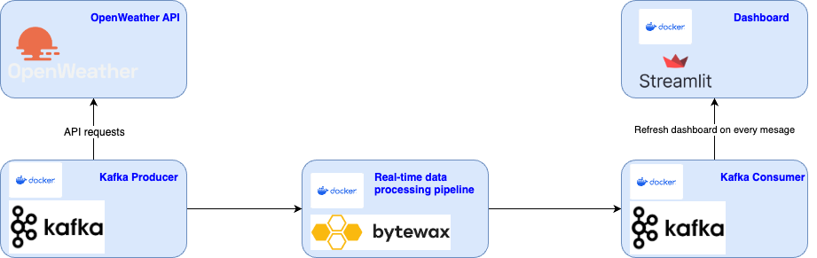

## Current Weather (Live-streaming dashboard)


### How does it work?:

To create any weather dashboard we need some... DATA. Obviously, we can mock it, but it is way less fun. So to get some real weather data, I used OpenWeather (https://openweathermap.org/) and to be precise, their API.

I've decided to decouple main parts of the system (I wanted to learn Kafka, that's the whole point of this project).

So we have a producer, that sends the request to OpenWeather API and forwards it into Kafka topic.

Next, I apply some basic data transformation. I've decided to use Stream Processing to make it more interesting (and I wanted to learn it as well). To do so, I've chosen Bytewax (https://bytewax.io/) which allows for creating real-time data pipelines and already has nice integration with Kafka. Transformed data is further send to another Kafka topic.

In the end, all that was produced, got to be consumed. Kafka Consumer get the processed data and Streamlit dashboard is refreshed every couple of minutes to show up to date weather metrics.

To combine all the services together, I used docker compose.




### Misc:

Install Python version
```
pyenv isntall 3.9.14
```

Create Python virtualenv
```
pyenv virtualenv 3.9.14 weather
```

Activate Python virtualenv
```
pyenv activate weather
```

Add virtualenv to Jupyter notebook
```
pip install --user ipykernel
python -m ipykernel install --user --name=weather
```

Install `kcat` to easily talk with Kafka on Docker
```
brew install kcat
```


### Useful commands
List Kafka topics:
```
docker exec -it kafka-broker kafka-topics.sh --bootstrap-server localhost:9092 --list
```

Delete Kafka topic:
```
docker exec -it kafka-broker kafka-topics.sh --bootstrap-server localhost:9092 --delete --topic <TOPIC_NAME>
```


### Useful resources:

Setting up Kafka on Docker: \
https://hackernoon.com/setting-up-kafka-on-docker-for-local-development

Setting up a configuiration file with Kafka listeners : \
https://rmoff.net/2018/08/02/kafka-listeners-explained/

- LISTENER_INTERNAL - communication within the docker network
- LISTENER_EXTERNAL - communication from localhost 